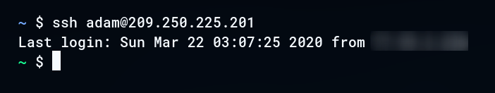

# VPS Guide

## Contents

- [VPS Guide](#vps-guide)
  - [Contents](#contents)
  - [Using this document](#using-this-document)
  - [Setting up the server](#setting-up-the-server)
    - [Log in as root](#log-in-as-root)
    - [Unlock SSH](#unlock-ssh)
    - [Add user](#add-user)
    - [Grant admin priviledges](#grant-admin-priviledges)
    - [Firewall setup](#firewall-setup)
    - [SSH Setup](#ssh-setup)
    - [Customise prompt](#customise-prompt)
    - [Disable passwords](#disable-passwords)
  - [Setup Nginx](#setup-nginx)
    - [Install Nginx](#install-nginx)
    - [Allow Nginx HTTP through firewall](#allow-nginx-http-through-firewall)
    - [Nginx controls](#nginx-controls)
  - [Add a domain to the server](#add-a-domain-to-the-server)
  - [Create a basic site for the domain](#create-a-basic-site-for-the-domain)
    - [Basic site location](#basic-site-location)
  - [Certbot SSL certificate](#certbot-ssl-certificate)
    - [Install Certbot](#install-certbot)
    - [Allow HTTPS through firewall](#allow-https-through-firewall)
    - [Add certificate](#add-certificate)
  - [FileZilla setup](#filezilla-setup)
  - [Using your server as a reverse proxy](#using-your-server-as-a-reverse-proxy)
    - [Write a basic web server in Go](#write-a-basic-web-server-in-go)

## Using this document

This document assumes the following information:  
(Note: This guide will still be useful if any of the following isn't true for you. You may be required to modify some of the instructions to suit your own needs)

- You are setting up a server running Debian 10
- You are using Linux on your local machine
- You are using the Vultr VPS service
- You are using the Namecheap domain registrar
- You are using the Go programming language

Placeholders are used for some information. You may choose to replace the placeholders with your own valid information.  
If so, use 'Find and Replace' in your text editor of choice to:

- Replace `your_server_ip` with your server ip
- Replace `your_domain` with your domain name
- Replace `your_username` with a username of choice for the primary server user

or use command-line  

`sed --in-place "s/your_server_ip/(your server ip)" "/path/to/this/file"`  
`sed --in-place "s/your_domain/(your domain name)" "/path/to/this/file"`  
`sed --in-place "s/your_username/(your chosen username)" "/path/to/this/file"`

## Setting up the server

Prerequisites:
- You have purchased a VPS and it's up and running
- You have knowledge of its IP and root password

### Log in as root

SSH into the server as root  
`$ ssh root@your_server_ip`

Check if your backspace is working, it might not. If not, use `export TERM=vt100` to fix it.  
To permanently fix it, `nano ~/.bashrc` and write `export TERM=vt100` at the bottom.

### Unlock SSH

Your SSH shell will lock after a period of time if it hasn't received any input.  
To unlock SSH, press `return` then `~` then `.`

### Add user

This will be your primary user who operates the server  
`# adduser your_username`

### Grant admin priviledges

Add this user to the sudo group  
`# usermod -aG sudo your_username`

### Firewall setup

Install **ufw**  
`# apt update`  
`# apt install ufw`  

Allow SSH  
`# ufw allow OpenSSH`  

Enable firewall  
`# ufw enable`  
`# ufw status`

### SSH Setup

Copy the SSH folder from root into the new user's home directory  
`# cp -r ~/.ssh /home/your_username`  
`# chown -R your_username:your_username /home/your_username/.ssh`

Use `exit` to leave as root, and SSH back in with the new user  
`$ ssh your_username@your_server_ip`

If your backspace wasn't working before, fix it for this user with `nano ~/.bashrc` and write `export TERM=vt100` at the bottom.

### Customise prompt

At this point you may choose to customise your prompt. Feel free to skip to [Disable passwords](#disable-passwords) if you aren't concerned about this.

I like my prompt to be a green variant of my local prompt, like so:

<kbd>
  
</kbd>

This way it's easy to distinguish if you are in your server shell or your local one.

Write your prompt at the bottom of `~/.bashrc`  
Sample: `export PS1='[\u@\h \W]\$ '`

Add colour by prepending `\e[0;31m` before some text. For example `export PS1='[\u@\h \e[0;31m\W]\$ \e[m'`

Make sure to change it back to normal text colour by putting `\e[m` before the end.

To change colour, replace `0;31` with one of the colour codes below:  

| Black | Blue | Green | Cyan | Red  | Purple | Brown |
| ----- | ---- | ----- | ---- | ---- | ------ | ----- |
| 0;30  | 0;34 | 0;32  | 0;36 | 0;31 | 0;35   | 0;33  |

Escape characters that can be used to display information:

| Character | Meaning                                                                              |
| --------- | ------------------------------------------------------------------------------------ |
| \a        | an ASCII bell character (07)                                                         |
| \d        | the date  in  "Weekday  Month  Date" format (e.g., "Tue May 26")                     |
| \e        | an ASCII escape character (033)                                                      |
| \h        | the hostname up to the first `.'                                                     |
| \H        | the hostname                                                                         |
| \j        | the  number of jobs currently managed by the shell                                   |
| \l        | the basename of the shell's terminal  device  name                                   |
| \n        | newline                                                                              |
| \r        | carriage return                                                                      |
| \s        | the  name  of  the shell, the basename of $0 (the portion following the final slash) |
| \t        | the current time in 24-hour HH:MM:SS format                                          |
| \T        | the current time in 12-hour HH:MM:SS format                                          |
| \@        | the current time in 12-hour am/pm format                                             |
| \u        | the username of the current user                                                     |
| \v        | the version of bash (e.g., 2.00)                                                     |
| \V        | the release of bash,  version  +  patchlevel (e.g., 2.00.0)                          |
| \w        | the current working directory                                                        |
| \W        | the  basename of the current working direc­tory                                      |
| \!        | the history number of this command                                                   |
| \#        | the command number of this command                                                   |
| \$        | if the effective UID is 0, a #, otherwise a $                                        |
| \nnn      | the  character  corresponding  to  the octal number nnn                              |
| \\        | a backslash                                                                          |
| \[        | begin a sequence of non-printing characters­                                         |
| \]        | end a sequence of non-printing characters                                            |

Here is the prompt that I use:  
`export PS1='\e[0;32m\W \e[m\$ '`

### Disable passwords

For security reasons, it's safer to disable password authentication into the server.

Open the SSD config file  
`$ sudo nano /etc/ssh/sshd_config`

Ensure these settings are as they appear below:
```
ChallengeResponseAuthentication no
PasswordAuthentication no
UsePAM no
PermitRootLogin no
```

Reload SSH  
`$ sudo systemctl reload ssh`

## Setup Nginx

### Install Nginx
`$ sudo apt update`  
`$ sudo apt install nginx`

### Allow Nginx HTTP through firewall
`$ sudo ufw app list`  
`$ sudo ufw allow 'Nginx HTTP'`  
`$ sudo ufw status`  
`$ systemctl status nginx`

You should now visit: **http://your_server_ip** and see the Nginx welcome page.

### Nginx controls
`$ sudo systemctl stop nginx`  
`$ sudo systemctl start nginx`  
`$ sudo systemctl restart nginx`  
`$ sudo systemctl reload nginx`  
`$ sudo systemctl disable nginx`  
`$ sudo systemctl enable nginx`

## Add a domain to the server

1. Update Namecheap nameservers to `ns1.vultr.com` and `ns2.vultr.com`
2. In Vultr dashboard: **DNS** > **New Domain**
3. Add a domain like the following:
   
```
A             your_server_ip
CNAME   *     your_domain
CNAME   www   your_domin
NS            ns1.vultr.com
NS            ns2.vultr.com
```

4. Edit Nginx config `sudo nano /etc/nginx/sites-available/default`
5. Replace `server_name _` with `server_name _ your_domain www.your_domain`
6. Error check Nginx `sudo nginx -t`
7. Restart Nginx `sudo systemctl restart nginx`
8. You should now be able to visit `http://your_domain`

## Create a basic site for the domain

### Basic site location
`$ sudo mkdir -p /var/www/your_domain/html`  
`$ sudo chown -R $USER:$USER /var/www/your_domain/html`  
`$ sudo chmod -R 755 /var/www/your_domain`

Open the site's index page  
`$ nano /var/www/your_domain/html/index.html`

Write the following to this file:

```html
<html>
    <head>
        <title>Welcome to your_domain</title>
    </head>
    <body>
        <h1>Success! Your Nginx server is successfully configured for <em>your_domain</em>. </h1>
        <p>This is a sample page.</p>
    </body>
</html>
```

Open your site's Nginx config file  
`sudo nano /etc/nginx/sites-available/your_domain`

Write the following to this file:

```
server {
    listen 80;
    listen [::]:80;

    root /var/www/your_domain/html;
    index index.html index.htm index.nginx-debian.html;

    server_name your_domain www.your_domain;

    location / {
        try_files $uri $uri/ =404;
    }
}
```

Symlink your config file to the Nginx sites-available directory.  
`sudo ln -s /etc/nginx/sites-available/your_domain/etc/nginx/sites-enabled/`

Open the Nginx config  
`sudo nano /etc/nginx/nginx.conf`

Ensure the server_names_hash_bucket_size setting is set to 64:

```conf
...
http {
    ...
    server_names_hash_bucket_size 64;
    ...
}
...
```

Restart Nginx  
`sudo nginx -t`  
`sudo systemctl restart nginx`

And check in your browser: http://your_server_ip  
You should see the index file you created: **Welcome to your_server_ip**

## Certbot SSL certificate

### Install Certbot

`$ sudo apt update`  
`$ sudo apt install python3-acme python3-certbot python3-mock python3-openssl python3-pkg-resources`  
`$ sudo apt install python3-certbot-nginx`

### Allow HTTPS through firewall

`$ sudo ufw status`  
`$ sudo ufw allow 'Nginx Full'`  
`$ sudo ufw delete allow 'Nginx HTTP'`

### Add certificate

`sudo certbot --nginx -d your_domain -d www.your_domain`

And check in your browser using HTTPS: **https**://your_server_ip

## FileZilla setup

1. Go to **Settings** > **Connection** > **SFTP**
2. Click **Add key file...**
3. Select your private key (`id_rsa`) file
4. Go to **File** > **Site Manger...**
5. Click **New site**
6. Protocol: **STFP - SSH File Transfer Protocol**
7. Host: **your_server_ip**
8. Port: (blank)
9. Logon Type: **Key file**
10. User: your_username
11. Key file: `your_home_dir/.ssh/id_rsa` (replace your_home_dir with the output of `echo $HOME`)

## Using your server as a reverse proxy

### Write a basic web server in Go

If you're using VS Code, run the `helloweb` code snippet. If not, here it is:

```go
package main

import (
	"fmt"
	"net/http"
	"time"
)

func greet(w http.ResponseWriter, r *http.Request) {
	fmt.Fprintf(w, "Hello World! %s", time.Now())
}

func main() {
	http.HandleFunc("/", greet)
	http.ListenAndServe(":8080", nil)
}
```

Save as `helloweb.go` and build with `go build -o helloweb helloweb.go`
  
Upload the binary onto your server with FileZilla and SSH into the server

Run the binary with `./helloweb`
  
Open another terminal, and SSH into the server

Run `curl http://localhost:8080` to check it works. The returned text should be `Hello World! 2020-03-22 02:08:16.742889307 +0000 UTC m=+11.757549613`

Then, open your site's config file  
`sudo nano /etc/nginx/sites-available/your_domain`
  
Replace the `location /` section in the main `server` block with the following:

```
server {
...
    location / {
        proxy_pass http://localhost:8080;
        proxy_http_version 1.1;
        proxy_set_header Upgrade $http_upgrade;
        proxy_set_header Connection 'upgrade';
        proxy_set_header Host $host;
        proxy_cache_bypass $http_upgrade;
    }
...
}
```

Restart Nginx  
`sudo nginx -t`  
`sudo systemctl restart nginx`

Check in your browser at `http://your_domain` and you should be able to see the output of the Go program.