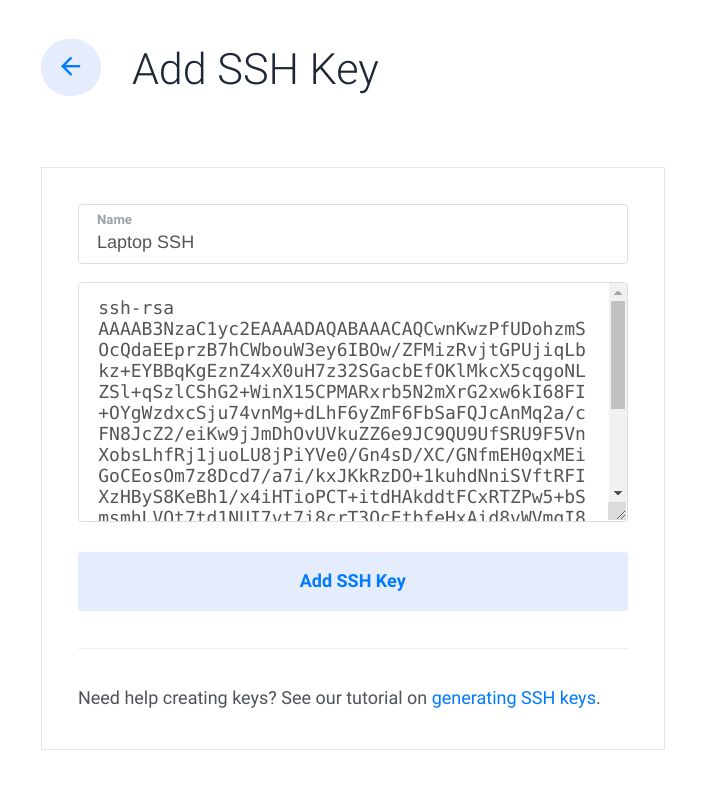
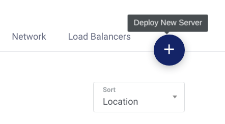
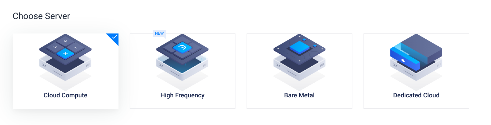
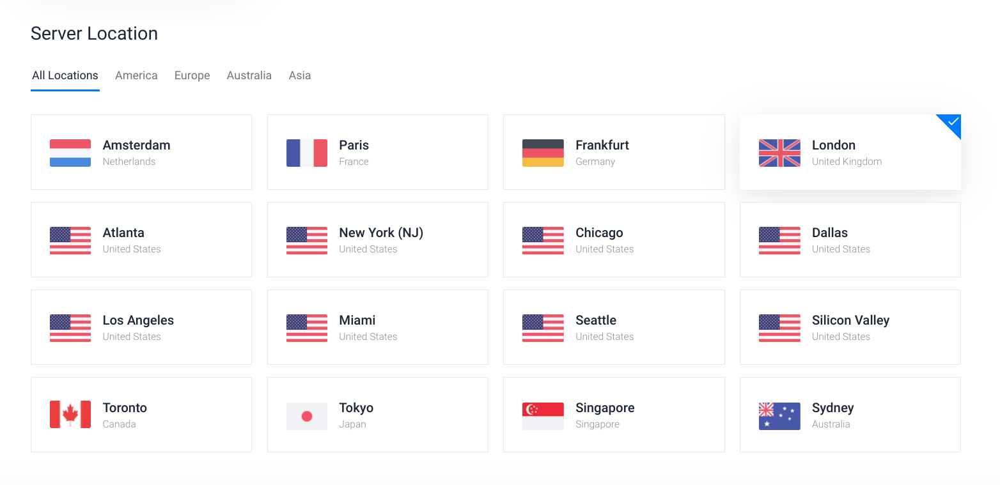
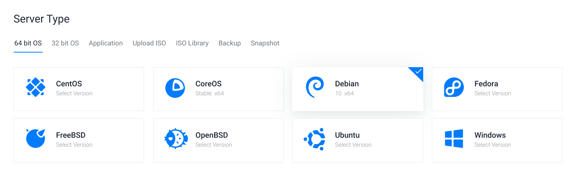
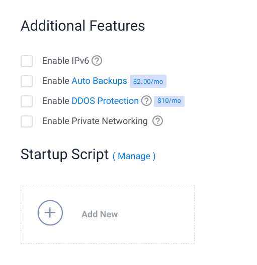
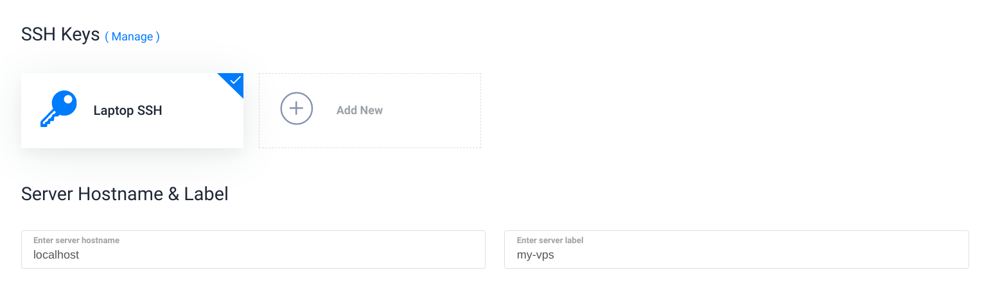
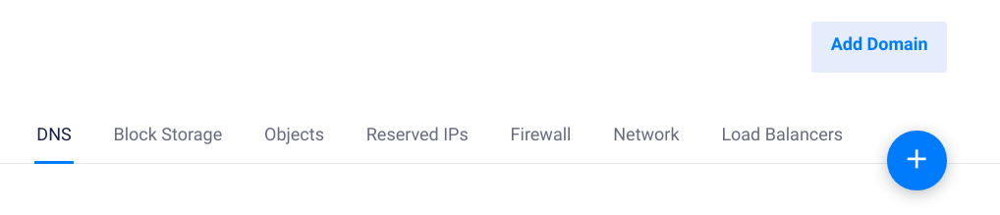

# VPS Guide <!-- omit in toc -->
 
## Contents <!-- omit in toc -->

- [Introduction](#introduction)
- [Using this document](#using-this-document)
- [Acquiring a VPS](#acquiring-a-vps)
  - [VPS provider](#vps-provider)
  - [Generate SSH key pair](#generate-ssh-key-pair)
  - [Deplying a new server](#deplying-a-new-server)
- [Setting up the server](#setting-up-the-server)
  - [Log in as root](#log-in-as-root)
  - [Unlock SSH](#unlock-ssh)
  - [Add user](#add-user)
  - [Grant admin priviledges](#grant-admin-priviledges)
  - [Firewall setup](#firewall-setup)
  - [SSH Setup](#ssh-setup)
  - [Customise prompt](#customise-prompt)
  - [Disable passwords](#disable-passwords)
- [Nginx Setup](#nginx-setup)
  - [Install Nginx](#install-nginx)
  - [Allow Nginx HTTP through firewall](#allow-nginx-http-through-firewall)
  - [Nginx controls](#nginx-controls)
- [Add a domain to the server](#add-a-domain-to-the-server)
- [Create a basic site for the domain](#create-a-basic-site-for-the-domain)
  - [Site location](#site-location)
- [Certbot SSL certificate](#certbot-ssl-certificate)
  - [Install Certbot](#install-certbot)
  - [Allow HTTPS through firewall](#allow-https-through-firewall)
  - [Add certificate](#add-certificate)
- [FileZilla setup](#filezilla-setup)
- [Using Nginx as a reverse proxy](#using-nginx-as-a-reverse-proxy)
  - [Write a basic web server in Go](#write-a-basic-web-server-in-go)

## Introduction

This document will guide you through the procedure of acquiring a VPS, setting it up and securing it, setting up an Nginx web server, linking it with a domain name, acquiring an SSL certificate, setting up a FileZilla FTP client, creating a basic website, and finally, using the Nginx web server as a reverse proxy for running your own programs in Go, Node.js, Python, Java, etc..

## Using this document

This document assumes the following information:  
(Note: This guide will still be useful if any of the following isn't true for you. You may be required to modify some of the instructions to suit your own needs)

- Your server is running Debian 10
- You are using Linux on your local machine
- You have an account with Vultr
- You have a domain registered with Namecheap
- You choose to use the Nginx web server
- You choose to use the Go programming language

Placeholders are used for some information. You may choose to replace the placeholders with your own valid information.  
If so, use 'Find and Replace' in your text editor of choice to:

- Replace `your_server_ip` with your server ip
- Replace `your_domain` with your domain name
- Replace `your_username` with a username of choice for the primary server user

or use command-line  

`sed --in-place "s/your_server_ip/(your server ip)" "/path/to/this/file"`  
`sed --in-place "s/your_domain/(your domain name)" "/path/to/this/file"`  
`sed --in-place "s/your_username/(your chosen username)" "/path/to/this/file"`

## Acquiring a VPS

### VPS provider

You can purchase a VPS from numerous VPS providers. For this guide, the provider of choice is Vultr, however, the same steps can be applied for any other provider. You can research and decide which VPS provider you like the best.

### Generate SSH key pair

Before deploying a new server, you should create an SSH key pair to use when authenticating with the server. These are 2 files, a public one and a private one. The public one is uploaded to your server, and the private one is kept secret on your machine. Only the user who has the private key may gain access to the server.

If you don't have a key pair already, generate one by running `ssh-keygen -t rsa -b 4096` on your local machine

Your public key is `~/.ssh/id_rsa.pub`  
And your private key is `~/.ssh/id_rsa` (you may choose to make a backup of this key)

Log into your Vultr account and go to **Products** > **SSH Keys**

Click **Add SSH Key** in the upper right

Choose an identifying name for your SSH Key, and copy paste the output of `cat ~/.ssh/id_rsa.pub` to the input field below



### Deplying a new server

Log into your Vultr account and go to **Products**

Click the **Deploy New Server** button



Select **Cloud Compute**



Select the server location closest to you



Select **Debian 10 x64** (although this procedure can easily be applied to any Linux server)



Select the server size most appropriate for your use case


Additional features aren't required, but you may choose to pay extra for automatic backups or DDOS protection. A startup script is not required either, but you may choose to create one. 



Choose the SSH key you added to your Vultr account, a hostname for the machine and a label to identify the VPS



Then click **Deploy Now**

## Setting up the server

### Log in as root

The `ssh` program will look in `~/.ssh` to find your private key.

SSH into the server as root  
`$ ssh root@your_server_ip`

Check if your backspace is working, it might not. If not, use `export TERM=vt100` to fix it.  
To permanently fix it, `nano ~/.bashrc` and write `export TERM=vt100` at the bottom.

### Unlock SSH

Your SSH shell will lock after a period of time if it hasn't received any input.  
To unlock SSH, press `return` then `~` then `.`

### Add user

This will be your primary user who operates the server  
`# adduser your_username`

### Grant admin priviledges

Add this user to the sudo group  
`# usermod -aG sudo your_username`

### Firewall setup

Install **ufw**  
`# apt update`  
`# apt install ufw`

Allow SSH  
`# ufw allow OpenSSH`

Enable firewall  
`# ufw enable`

View firewall status  
`# ufw status`

### SSH Setup

Copy the SSH folder from root into the new user's home directory  
`# cp -r ~/.ssh /home/your_username`  
`# chown -R your_username:your_username /home/your_username/.ssh`

Use `exit` to leave as root, and SSH back in with the new user  
`$ ssh your_username@your_server_ip`

If your backspace wasn't working before, fix it for this user with `nano ~/.bashrc` and write `export TERM=vt100` at the bottom.

### Customise prompt

At this point you may choose to customise your prompt. Feel free to skip to [Disable passwords](#disable-passwords) if you aren't concerned about this.

I like my prompt to be a green variant of my local prompt:

<kbd>
  
</kbd>

This way it's easy to distinguish if you are in your server shell or your local one.

Write your prompt at the bottom of `~/.bashrc`  
Sample: `export PS1='[\u@\h \W]\$ '`

Add colour by prepending `\e[0;31m` before some text. For example `export PS1='[\u@\h \e[0;31m\W]\$ \e[m'`

Make sure to change it back to normal colour by putting `\e[m` before the end.

To change colour, replace `0;31` with one of the colour codes below:  

| Black | Blue | Green | Cyan | Red  | Purple | Brown |
| ----- | ---- | ----- | ---- | ---- | ------ | ----- |
| 0;30  | 0;34 | 0;32  | 0;36 | 0;31 | 0;35   | 0;33  |

Escape characters can be used to display information.

<details>
  <summary>Click here for list of escape characters</summary>

  | Character | Meaning                                                                              |
  | --------- | ------------------------------------------------------------------------------------ |
  | \a        | an ASCII bell character (07)                                                         |
  | \d        | the date  in  "Weekday  Month  Date" format (e.g., "Tue May 26")                     |
  | \e        | an ASCII escape character (033)                                                      |
  | \h        | the hostname up to the first `.'                                                     |
  | \H        | the hostname                                                                         |
  | \j        | the  number of jobs currently managed by the shell                                   |
  | \l        | the basename of the shell's terminal  device  name                                   |
  | \n        | newline                                                                              |
  | \r        | carriage return                                                                      |
  | \s        | the  name  of  the shell, the basename of $0 (the portion following the final slash) |
  | \t        | the current time in 24-hour HH:MM:SS format                                          |
  | \T        | the current time in 12-hour HH:MM:SS format                                          |
  | \@        | the current time in 12-hour am/pm format                                             |
  | \u        | the username of the current user                                                     |
  | \v        | the version of bash (e.g., 2.00)                                                     |
  | \V        | the release of bash,  version  +  patchlevel (e.g., 2.00.0)                          |
  | \w        | the current working directory                                                        |
  | \W        | the  basename of the current working direc­tory                                      |
  | \!        | the history number of this command                                                   |
  | \#        | the command number of this command                                                   |
  | \$        | if the effective UID is 0, a #, otherwise a $                                        |
  | \nnn      | the  character  corresponding  to  the octal number nnn                              |
  | \\        | a backslash                                                                          |
  | \[        | begin a sequence of non-printing characters­                                         |
  | \]        | end a sequence of non-printing characters                                            |
</details>

Here is the prompt that I use:  
`export PS1='\e[0;32m\W \e[m\$ '`

### Disable passwords

For security reasons, it's safer to disable password authentication into the server.

Open the SSH config file  
`$ sudo nano /etc/ssh/sshd_config`

Ensure these settings are as they appear below:
```
ChallengeResponseAuthentication no
PasswordAuthentication no
UsePAM no
PermitRootLogin no
```

Reload SSH  
`$ sudo systemctl reload ssh`

## Nginx Setup

### Install Nginx
`$ sudo apt update`  
`$ sudo apt install nginx`

### Allow Nginx HTTP through firewall
`$ sudo ufw app list`  
`$ sudo ufw allow 'Nginx HTTP'`

Check the status of the firewall and of Nginx  
`$ sudo ufw status`  
`$ systemctl status nginx`

You should now visit: **http://your_server_ip** and see the Nginx welcome page.

### Nginx controls
`$ sudo systemctl stop nginx`  
`$ sudo systemctl start nginx`  
`$ sudo systemctl restart nginx`  
`$ sudo systemctl reload nginx`  
`$ sudo systemctl disable nginx`  
`$ sudo systemctl enable nginx`

## Add a domain to the server

1. Update Namecheap nameservers to `ns1.vultr.com` and `ns2.vultr.com`
2. In Vultr dashboard go to **DNS** > **Add Domain**  
   
3. Add a domain like the following:
   
```
A             your_server_ip
CNAME   *     your_domain
CNAME   www   your_domin
NS            ns1.vultr.com
NS            ns2.vultr.com
```

4. Edit your Nginx config `sudo nano /etc/nginx/sites-available/default`
5. Replace `server_name _` with `server_name _ your_domain www.your_domain`
6. Error check Nginx using `sudo nginx -t`
7. And restart Nginx using `sudo systemctl restart nginx`
8. You should now be able to visit **http://your_domain**

## Create a basic site for the domain

### Site location

Create a location for your site files  
`$ sudo mkdir -p /var/www/your_domain/html`  
`$ sudo chown -R $USER:$USER /var/www/your_domain/html`  
`$ sudo chmod -R 755 /var/www/your_domain`

Open the site's index page  
`$ nano /var/www/your_domain/html/index.html`

Write the following to this file:

```html
<html>
    <head>
        <title>Welcome to your_domain</title>
    </head>
    <body>
        <h1>Success! Your Nginx server is successfully configured for <em>your_domain</em>. </h1>
        <p>This is a sample page.</p>
    </body>
</html>
```

Open your site's Nginx config file  
`$ sudo nano /etc/nginx/sites-available/your_domain`

Write the following to this file:

```
server {
    listen 80;
    listen [::]:80;

    root /var/www/your_domain/html;
    index index.html index.htm index.nginx-debian.html;

    server_name your_domain www.your_domain;

    location / {
        try_files $uri $uri/ =404;
    }
}
```

Symlink your config file to the Nginx sites-enabled directory  
`$ sudo ln -s /etc/nginx/sites-available/your_domain /etc/nginx/sites-enabled/`

Open the Nginx config  
`$ sudo nano /etc/nginx/nginx.conf`

To avoid a hash bucket memory problem that can occur when adding additional server names, uncomment this setting in your Nginx config by removing the preceding hash symbol  

```conf
...
http {
    ...
    server_names_hash_bucket_size 64;
    ...
}
...
```

Restart Nginx  
`$ sudo nginx -t`  
`$ sudo systemctl restart nginx`

And check in your browser: **http://your_domain**  
You should see the index file you created: **Welcome to your_domain**

## Certbot SSL certificate

Obtaining an SSL certificate is a requirement for a secure server. This allows users to connect to the server via the encrypted HTTPS protocol.

### Install Certbot

`$ sudo apt update`  
`$ sudo apt install python3-acme python3-certbot python3-mock python3-openssl python3-pkg-resources`  
`$ sudo apt install python3-certbot-nginx`

### Allow HTTPS through firewall

`$ sudo ufw status`  
`$ sudo ufw allow 'Nginx Full'`  
`$ sudo ufw delete allow 'Nginx HTTP'`

### Add certificate

`$ sudo certbot --nginx -d your_domain -d www.your_domain`  
You may choose to redirect HTTP traffic to HTTPS when asked

And check in your browser using HTTPS: **https://your_server_ip**

If you check your site's config file `/etc/nginx/sites-available/your_domain`, you will notice that Certbot has added settings in the main server block, and additionally, the redirect settings if you chose to enable that when asked.

## FileZilla setup

FileZilla is a widely used FTP GUI client, used to upload and download files from your server.  
It is available from all of the main Linux repos, and Windows. For Arch-based distributions, use `sudo pacman -S filezilla`

1. Go to **Settings** > **Connection** > **SFTP**
2. Click **Add key file...**
3. Select your private key (`id_rsa`) file
4. Go to **File** > **Site Manger...**
5. Click **New site**
6. Protocol: **STFP - SSH File Transfer Protocol**
7. Host: **your_server_ip**
8. Port: (blank)
9. Logon Type: **Key file**
10. User: your_username
11. Key file: `your_home_dir/.ssh/id_rsa` (replace your_home_dir with the output of `echo $HOME`)

## Using Nginx as a reverse proxy

Currently, Nginx is serving our files for us. When a user visits our domain, Nginx spits out files from `/var/www/your_domain/html`, and that's all. For basic static websites, this is all that is really needed. However, for more advanced, dynamic websites, you may choose to write your own web server in a language such as Node.js, Go, Python, Java, or any other.

For this, we will use Nginx as a reverse proxy. Nginx will receive requests, and instead of dealing with them itself, it will pass it onto your program.

Nginx receives HTTP requests on port **80**, and HTTPS requests on **443**. When you visit **http://your_domain** it's the same as visiting **http://your_domain:80**

The procedure of reverse proxying is to run a program on a port of your choice (quite often port **8080**), and to have Nginx relay the requests it receives to that port.

Your program runs on a closed port, so users won't visit **http://your_domain:8080** to visit your web server, instead, users are required to go through Nginx (port **80**) to access your web server. This is important for security and stability.

### Write a basic web server in Go

If you're using VS Code, run the `helloweb` code snippet. If not, here it is:

```go
package main

import (
	"fmt"
	"net/http"
	"time"
)

func greet(w http.ResponseWriter, r *http.Request) {
	fmt.Fprintf(w, "Hello World! %s", time.Now())
}

func main() {
	http.HandleFunc("/", greet)
	http.ListenAndServe(":8080", nil)
}
```

Save as `helloweb.go` and build with `go build -o helloweb helloweb.go`
  
Upload the binary onto your server with FileZilla and SSH into the server

Set appropriate file permissions for **helloweb**: `sudo chmod 744 helloweb`

And run the binary with `./helloweb`
  
Open another terminal, and SSH into the server

Run `curl http://localhost:8080` to check it works. The returned text should be `Hello World! 2020-03-22 02:08:16.742889307 +0000 UTC m=+11.757549613`

Then, open your site's config file  
`$ sudo nano /etc/nginx/sites-available/your_domain`

Replace the `location /` section in the main `server` block with the following:

```
server {
...
    location / {
        proxy_pass http://localhost:8080;
        proxy_http_version 1.1;
        proxy_set_header Upgrade $http_upgrade;
        proxy_set_header Connection 'upgrade';
        proxy_set_header Host $host;
        proxy_cache_bypass $http_upgrade;
    }
...
}
```

Restart Nginx  
`$ sudo nginx -t`  
`$ sudo systemctl restart nginx`

Check in your browser at `http://your_domain` and you should be able to see the output of the Go program

You can have any number of apps running on any number of ports

For example, you can have an entirely different web server running on port **8081**, and access it via **https://your_domain/app2**

Do this by adding an additional location block within this same server block, like the following:

```
...
    location /app2 {
        proxy_pass http://localhost:8081;
        proxy_http_version 1.1;
        proxy_set_header Upgrade $http_upgrade;
        proxy_set_header Connection 'upgrade';
        proxy_set_header Host $host;
        proxy_cache_bypass $http_upgrade;
    }
...
```

To use multiple domains, you can use this same server block structure, only modifying `server_name my_other_domain` and `proxy_pass` to the port where your other site is running.